<div align="center">


<br/>


<br/>


<br/>


</div>

---

# 👋 About Me

I'm **Mohamed Ansaar**, a Python developer and coding educator with around **6 years of experience in EdTech**, currently building my career towards **Machine Learning and Artificial Intelligence**.

My focus is moving from programming and data analysis toward building complete AI/ML solutions:

**Data → Analysis → Features → Models → Evaluation → Applications → Deployment**

I believe the best way to learn AI is by:

**Learning → Building → Experimenting → Debugging → Improving**

```python
mohamed = {
    "focus": [
        "Machine Learning",
        "Artificial Intelligence",
        "Data"
    ],

    "languages": [
        "Python",
        "JavaScript",
        "C"
    ],

    "frontend": [
        "React.js"
    ],

    "experience": "6+ years in Coding Education",

    "currently_learning": [
        "Machine Learning",
        "SQL",
        "Statistics",
        "Streamlit"
    ],

    "goal": "Build real-world AI/ML systems"
}
```

---

# 🛠️ AI / ML Tech Stack

## 💻 Programming

<p>

</p>

`Python — Intermediate` • `JavaScript` • `C`

---

## 🌐 Web Development

<p>

</p>

`React.js` • `HTML` • `CSS`

---

## 📊 Data

`Pandas` • `NumPy` • `Matplotlib` • `Excel`

---

## 🤖 Machine Learning

`Scikit-learn`

Currently developing practical experience with:

`Regression` • `Classification` • `Clustering` • `Feature Engineering` • `Model Evaluation`

---

## 🗄️ Data & Databases

`SQL — Learning`

---

## 🚀 ML Applications

`Streamlit — Learning`

---

## 🔧 Tools

<p>

</p>

`Git` • `GitHub` • `VS Code` • `Jupyter Notebook`

---

# 📊 Skill Progress

| Technology | Level | Focus |
|---|:---:|---|
| 🐍 Python | 🟢 Intermediate | Data + ML |
| 🟨 JavaScript | 🟡 Working Knowledge | Web Development |
| 🔵 C | 🟡 Working Knowledge | Programming Fundamentals |
| ⚛️ React.js | 🟡 Working Knowledge | Frontend |
| 📊 Pandas | 🟢 Working Knowledge | Data Analysis |
| 🔢 NumPy | 🟢 Working Knowledge | Numerical Computing |
| 📈 Matplotlib | 🟢 Working Knowledge | Visualization |
| 📗 Excel | 🟢 Intermediate | Analytics |
| 🗄️ SQL | 🟡 Learning | Data |
| 🤖 Scikit-learn | 🟡 Learning | Machine Learning |
| 🚀 Streamlit | 🟡 Learning | ML Applications |

### Legend

🟢 Comfortable / Working Knowledge  
🟡 Currently Learning  
🔵 Planned

---

# 🤖 Machine Learning

I'm currently strengthening my understanding of the complete **Machine Learning workflow**.

### Working On

- Exploratory Data Analysis
- Data Cleaning
- Data Preprocessing
- Feature Engineering
- Regression
- Classification
- Clustering
- Model Evaluation
- Model Selection
- Hyperparameter Tuning
- Building ML applications

My goal isn't just:

```python
model.fit(X_train, y_train)
```

I want to understand:

**Why the model works → When to use it → How to evaluate it → How to improve it → How to deploy it**

---

# 🚀 Featured Projects

## 🌍 World Water & Air Quality Analysis

**Data Analysis • Python**

Exploratory analysis of global environmental data to understand patterns in water quality and air pollution.

### What I Practiced

- Data Cleaning
- Exploratory Data Analysis
- Data Visualization
- Pandas
- NumPy
- Matplotlib
- Trend Analysis
- Insight Generation

**Tech**

`Python` `Pandas` `NumPy` `Matplotlib`

---

## 👨‍🏫 Tutor Analysis

**Data Analytics • Python • Excel**

Analysis of tutor-related data to identify meaningful patterns and generate actionable insights.

### What I Practiced

- Data Cleaning
- Exploratory Analysis
- Performance Analysis
- Visualization
- Insight Generation

**Tech**

`Python` `Pandas` `Excel`

---

## 🧪 Machine Learning Projects

🚧 **Currently Building**

This section will grow as I complete ML projects.

### Planned Projects

- Customer Churn Prediction
- Customer Segmentation
- House Price Prediction
- Recommendation Systems
- NLP Classification
- End-to-End ML Applications

---

# 🗺️ AI / ML Roadmap

This roadmap will evolve as my knowledge grows.

## 🟢 Foundation

- [x] Python
- [x] NumPy
- [x] Pandas
- [x] Matplotlib
- [x] Data Cleaning
- [x] Exploratory Data Analysis
- [ ] Statistics for Machine Learning
- [ ] Advanced SQL

## 🤖 Machine Learning

- [ ] Linear Regression
- [ ] Logistic Regression
- [ ] Decision Trees
- [ ] Random Forest
- [ ] K-Nearest Neighbors
- [ ] Support Vector Machines
- [ ] Naive Bayes
- [ ] K-Means Clustering
- [ ] PCA
- [ ] Feature Engineering
- [ ] Hyperparameter Tuning
- [ ] Cross Validation

## 🧠 Deep Learning

- [ ] Neural Networks
- [ ] PyTorch
- [ ] TensorFlow
- [ ] CNN
- [ ] RNN / LSTM
- [ ] Transformers

## 💬 Generative AI

- [ ] LLM Fundamentals
- [ ] Prompt Engineering
- [ ] Embeddings
- [ ] Vector Databases
- [ ] RAG
- [ ] AI Agents
- [ ] LLM APIs
- [ ] Fine-Tuning

## ⚙️ MLOps

- [ ] FastAPI
- [ ] Docker
- [ ] MLflow
- [ ] Model Deployment
- [ ] Model Monitoring
- [ ] CI/CD for ML
- [ ] Cloud Fundamentals

---

# 🎯 Current Focus

```yaml
current_phase: "Machine Learning Foundations"

learning:
  - Machine Learning
  - SQL
  - Statistics
  - Streamlit

building:
  - Data Analysis Projects
  - Machine Learning Projects
  - Python Applications

next:
  - Deep Learning
  - NLP
  - Generative AI
  - RAG
  - MLOps

career_target:
  - Machine Learning Engineer
  - AI Engineer
  - Data / ML Roles
```

---

# 🧑‍🏫 Professional Background

Before moving deeper into AI/ML, I built around **6 years of experience in coding education and EdTech**.

Teaching programming has helped me develop:

- Strong programming fundamentals
- Problem decomposition
- Debugging
- Technical communication
- Mentoring
- Explaining complex concepts simply
- Continuous learning

Now I'm combining that experience with **Machine Learning and Artificial Intelligence** to build practical intelligent applications.

---

# 📈 GitHub Analytics

<div align="center">





</div>

---

# 🏆 GitHub Trophies

<div align="center">


</div>

---

# 🐍 Contribution Snake

<div align="center">

<picture>
  <source media="(prefers-color-scheme: dark)" srcset="./profile/github-snake-dark.svg">
  <source media="(prefers-color-scheme: light)" srcset="./profile/github-snake.svg">
  
</picture>

</div>

---

# 🌱 Learning in Public

This GitHub profile represents my **actual learning journey**.

I prefer:

> **Build > Claim**

Technologies are added to my main stack only after I gain practical experience with them.

Until then, they remain in my roadmap.

As I learn more, this profile will evolve:

**Python → Data → ML → Deep Learning → Generative AI → MLOps**

---

# 📫 Connect With Me

<div align="center">

[](https://github.com/MDAnsaar25)

[](YOUR_LINKEDIN_URL)

</div>

---

<div align="center">

### 🧠 Learn → Build → Experiment → Improve → Repeat

**Building my path from Python & Data to Machine Learning & AI. 🚀**

</div>
